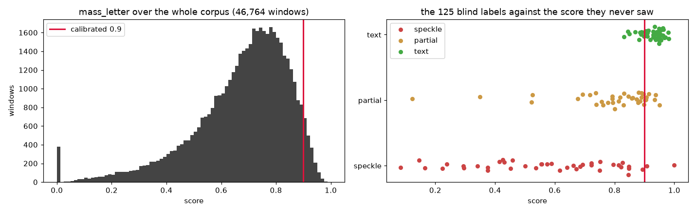

# Ink Prediction Failure Atlas

**A map of where the published ink-detection pipeline fails, across the entire open corpus —
every prediction scored on windows of equal physical area — plus a pixel-pitch unit trap that
silently doubles the scale of 112 of the 423 published predictions.**

📊 **[Browse the atlas →](https://armando-gaona.github.io/vesuvius-ink-atlas/)**

Today there is no objective criterion for "is this prediction readable?". The de-facto
standard is *a person looked at it* — officially, ink detection is evaluated
*"as determined by the Vesuvius Challenge's Papyrological Team"*. That does not scale to 423
predictions, and it cannot tell a model developer whether last month's change helped.

This repository puts a reproducible number in its place, calibrates that number against blind
hand labels, and applies it to the whole published corpus.

The output that matters is **where the pipeline fails**, and that answer is at scroll level,
not prediction level: on windows of identical physical area, **PHerc0172 reaches the legible
threshold on 0.54% of its papyrus area [0.35, 0.83] against 5.48% for PHercParis4** — a gap
whose confidence intervals do not overlap and which the metric's own scale sensitivity cannot
account for ([`scripts/pitch_ablation.py`](scripts/pitch_ablation.py)).

> **Retracted, and left here on purpose.** This README used to lead with a *failure list*: the
> 91 predictions containing not one readable window. **That list does not survive its own
> checks and should not be used.** Two independent tests each removed a different half of it.
> Rendering the best window of all 70 predictions that clear nothing anywhere on their raster
> ([`figures/failure_review/`](figures/failure_review)) showed 11 of them containing plainly
> readable Greek — false positives of the metric. Testing the rest against their own scroll's
> base rate showed a prediction carries a median of 30 independent windows, so 30 empty ones
> happen 21% of the time at a 5% base rate; only 4 of the 70 are surprising
> ([`scripts/failure_significance.py`](scripts/failure_significance.py)). And those 4 are four
> of the 11 with readable Greek. The intersection of *statistically surprising* and *visually
> failing* is empty. `data/failures.csv` stays published as the record, with
> [`data/failure_visual_review.csv`](data/failure_visual_review.csv) and
> [`data/failure_significance.csv`](data/failure_significance.csv) beside it, so the retraction
> is checkable rather than asserted.

It needs **no GPU, no model and no training**: it scores predictions the project has already
published, using connected components and a per-image Otsu threshold. The cost is bandwidth.

> Motivated by the project's own framing in
> [2026 Open Problems](https://scrollprize.org/2026_open_problems):
> *"This is why better diagnostics matter just as much as better models — without them,
> it's hard to know which of these failure modes you're even fighting."*

---

## Headline results

| | |
|---|---|
| Predictions indexed | **423** (226 segments, 7 scrolls) |
| Predictions actually scored | **374** — the other 49 are accounted for in [`data/atlas_manifest.csv`](data/atlas_manifest.csv) |
| Windows scored | **46,764**, each covering an identical **19.65 × 19.65 mm** of papyrus |
| Windows that are statistically independent | **12,387** — the grid overlaps 4×, so every percentage below is over this subset |
| Legibility metric | `mass_letter` — ink mass in connected components 960–7200 µm across |
| Validation | **AUC 0.931** against 125 blind, stratified hand labels |
| Calibrated threshold | **0.900** (best F1 = 0.800; precision 0.818, recall 0.783) |
| **Legible fraction of the corpus** | **3.92%**, 95% CI **[3.60%, 4.28%]** (486 of 12,387 windows) |
| **Widest established gap** | **PHerc0172 0.54% [0.35, 0.83] vs PHercParis4 5.48% [5.00, 6.01]** — non-overlapping, and ≤5 of those 90 relative points are the scorer's own scale sensitivity |
| ~~Predictions with zero readable windows~~ | ~~91 of 170 ranked~~ — **retracted**, see the note above. Nothing in that list survives both a visual check and a size test |

Because every window covers the same *physical* area, "% of windows" is literally
**"% of papyrus area"**.

### Per scroll, at the calibrated threshold

Over the non-overlapping subset, with Wilson 95% intervals. Four of the seven scrolls have
intervals wide enough that their ordering is not established.

| scroll | windows | legible | % | 95% CI |
|---|---:|---:|---:|---|
| PHerc1667 | 307 | 29 | **9.45%** | [6.66%, 13.24%] |
| PHerc0814 | 13 | 1 | 7.69% | [1.37%, 33.31%] |
| PHercParis4 | 7,933 | 435 | 5.48% | [5.00%, 6.01%] |
| PHerc0172 | 3,710 | 20 | 0.54% | [0.35%, 0.83%] |
| PHerc0139 | 396 | 1 | 0.25% | [0.04%, 1.42%] |
| PHerc0343P | 8 | 0 | 0.00% | [0.00%, 32.44%] |
| PHerc0500P2 | 20 | 0 | 0.00% | [0.00%, 16.11%] |

**The gap between the top and bottom rows is the finding.** PHerc0172 and PHercParis4 have
thousands of independent windows each, their intervals are nowhere near touching, and the
ordering does not depend on the threshold: at 0.850 it is 4.20% vs 16.16%, at 0.950 it is
0.00% vs 0.49%. The four scrolls in between carry too few windows to be ranked against one another
and are not claimed to be.

Counting the same thing per *prediction* instead — 91 with zero readable windows, of which 70
have nothing over the threshold anywhere on their raster — is what this repository used to
lead with, and it is retracted; see the note at the top. The arithmetic was right and the
inference was not. `data/failures.csv` and the `n_text_all` column that splits those two
halves are still published, as the record of a claim that failed rather than as a work list.

### An external check nobody arranged

The ranking was computed with no knowledge of which scrolls have actually been read. It puts
in first and second place the only two that have been: **PHerc1667**, the first scroll
unwrapped and read end to end (2026), and **PHercParis4**, the 2023 Grand Prize scroll.

This is corroboration, not proof — those two are also the best-scanned and most-worked
scrolls, so the causality runs both ways. But the agreement was not engineered, and it is the
cheapest available evidence that the ordering means something.

---

## Corrections to the first published version

If you read this repository before, the headline moved from **4.08%** to **3.92% [3.60%,
4.28%]** and the failure list from 82 predictions to 91. Four things were wrong. All four
were found by auditing our own output, and each is fixed in the scripts, not just in the
prose.

### 1. The published AUC of 0.930 could not be reproduced from the published atlas

`calibrate.py` read each labelled window's score from `labeling_key.csv` — the file written
when the sample was *drawn* — instead of from `atlas.csv`. The key stores a snapshot. The
metric was fixed afterwards (the window-geometry correction, item 3 in the microns section
below), and **6 of the 125 rows silently kept their pre-fix score**. All six were PHerc0172,
all six came from the supplementary labelling round that skipped `rejoin_key.py`, and most
were inflated — one `text` window by +0.211, one `partial` by +0.261.

Scored honestly from the atlas, **AUC is 0.918, not 0.930**. The threshold 0.900 survives
unchanged; precision at it is 0.800, and recall drops from 0.804 to 0.783.

The 0.930 is earned back legitimately, by a different route. `mass_letter` is a *fraction*,
so a window holding almost no ink can score high on the little it holds. Refusing to score
windows below `frac_above ≥ 0.05` lifts AUC to **0.931** and precision to **0.818** without
losing a single `text` label — the lowest `frac_above` among the 46 is 0.1098, more than
twice the floor. But a paired bootstrap puts that gain at **+0.013, 95% CI [0.000, 0.041],
P(gain > 0) = 0.648**, and it comes down to one window. **It ships as a guard, not as a
measured improvement.** `--ink-floor 0` turns it off in every script that uses it, and the
whole run without it is published as
[`results/calibration_no_ink_floor.txt`](results/calibration_no_ink_floor.txt): AUC 0.918,
corpus **3.96% [3.63%, 4.31%]** against 3.92%, failure list **88** predictions against 91.
The guard is therefore not free — it moves three predictions into the failure list — but no
conclusion here rests on it, and both runs are published side by side.

`calibrate.py` now reads scores from the atlas and prints a warning naming any key row that
has gone stale.

### 2. Every percentage was computed over a 4× oversampled grid

The atlas strides by half a window in both axes, so each patch of papyrus is covered about
four times and adjacent rows share pixels. Percentages over that grid are percentages of
nothing physical, and any confidence interval over it is roughly twice too narrow.

All statistics now go over a **non-overlapping tiling** — drop the odd half-steps, keep
12,387 of 46,764 windows, same physical area each, no shared pixels. The full grid is still
what the maps and contact sheets are drawn from, where overlap is a feature.

The headline barely moved (4.08% → 3.92%). The point is that it now comes with an interval
that means something.

### 3. `(scroll, segment, recipe)` is not a unique key

The same segment is published more than once under the same recipe label — different models,
same three-token name. Grouping by that tuple merged distinct predictions into one row:
**6,172 atlas rows collided**, and `build_site_index.py` was handing one prediction's pixel
pitch to another prediction's row.

Everything is now keyed on the prediction's S3 path. `atlas.csv` carries a `key` column,
`segment_summary.csv` has one row per *prediction* (374, not 321), and the map filenames no
longer encode a computed percentage that goes stale the moment the metric is recomputed.

### 4. The denominator was unstated

49 of the 423 published predictions were never scored — too small for one window, too little
on-segment coverage, or no resolvable pitch — and they were simply absent, in neither the
numerator nor the denominator. Any "% readable" was quoted over an unstated subset.

[`data/atlas_manifest.csv`](data/atlas_manifest.csv) now has one row per published
prediction with the reason: **374 scored, 25 too small, 22 below the coverage floor, 2 with
no resolvable pitch**. Two scrolls are scored over less than half of themselves — PHerc0814
and PHerc0500P2 — and their rows above should be read accordingly.

### And one thing that was checked and turned out fine

The atlas scores 8× downsampled **JPEGs**, and JPEG is lossy at the 8×8 block scale, which
is the scale at which the binarisation decides whether two blobs touch. So the whole atlas
could have been measuring compression artefacts. [`scripts/jpeg_effect.py`](scripts/jpeg_effect.py)
re-derives the ds8 raster losslessly from the full-resolution TIFF, re-encodes it at the
published quality, and compares — 408 windows over 6 predictions spanning every pitch in the
corpus:

| comparison | mean Δ | sd | r | windows that flip at 0.900 |
|---|---:|---:|---:|---:|
| JPEG loss alone (requant − lossless) | −0.0007 | 0.0111 | 0.9986 | **0 / 408** |
| published JPEG − lossless | +0.0000 | 0.0059 | 0.9996 | 2 / 408 |
| stress test at quality 50 | +0.0002 | 0.0121 | 0.9984 | 2 / 408 |

A letter is ~160 px at ds8, twenty times the JPEG block. The metric does not see the
compression. Raw numbers in [`data/jpeg_effect.csv`](data/jpeg_effect.csv).

---

## ⚠️ A unit trap that affects anyone working at physical scale

**The µm token in a published prediction's filename names the SOURCE SCAN, not the pixel
pitch of the raster.** Renders are frequently taken from a downsampled level of the
multiscale pyramid.

| recipe | µm in the filename | `source_group` | **actual raster pitch** |
|---|---|---|---|
| canon | 2.399 | 0 | 2.399 µm/px |
| `1um_s1z2` | 1.129 | **1** | **2.258 µm/px** |

The `1um_s1z2` predictions are rendered from **level 1** of the pyramid, so their true pitch
is **2× coarser** than that token declares. This affects **112 of 423** published predictions.

### To be precise about whose fault this is: the filename is not wrong

It also carries the pyramid level, as a separate `-L1-` token, and `named_µm × 2^L`
reproduces the true pitch in **421 of the 421** predictions whose zarr we could resolve. The
`L` token is absent exactly when the level is 0. The information is all there, and it is
self-consistent.

What is missing is any statement that the two tokens must be combined. They sit ~40
characters apart in a ~100-character filename, and the naive read — take the µm token as the
pitch — is silently wrong by exactly 2× on 112 files. **This is a documentation gap, not a
data defect**, and it is reported as one. The original wording here called it a bug; that was
an overclaim, corrected after checking the `L` token against every file.

**How the discrepancy shows up without trusting any metadata** ([`scripts/check_pitch.py`](scripts/check_pitch.py)):
113 segments are published under two recipes. Those are the same physical surface, so
`width_px × pitch_um` must match. Result: **113/113 have the same pixel dimensions**
(ratio 1.06) but physical widths differing by **×2.00** under the naive reading. Impossible
for the same papyrus. Resolved authoritatively by reading `source_group` from each
surface-volume zarr's `.zattrs` ([`scripts/fetch_pitch.py`](scripts/fetch_pitch.py)), which
agrees with the `L` token in every case.

**What it cost us — this is what the trap is worth in practice.** An earlier version of this
analysis found recipe `canon` beating `1um_s1z2` in **36 of 36** paired segments (sign test
p ≈ 2.9e-11). After the fix: **14/36, p = 0.243**. The sweep was *entirely* the unit error.
**That finding is retracted — there is no detectable difference between the two recipes.**

If you build anything that compares sizes, resolutions, or areas across this corpus, resolve
the pitch from the zarr `source_group` (or from the `L` token), never from the µm token alone.

---

## Method, and why each piece is the way it is

### Legibility is a property of *scale*, not of intensity

Intensity signals (99th-percentile logit, positive fraction, probability std) order known
readable and unreadable zones correctly but with margins too small to threshold. Spatial
structure separates them cleanly: a letter is ~3 mm across, so text puts nearly all its ink
mass into large connected components, and a speckle field puts none.

### The metric is a *band*, not a lower bound

A saturated prediction is **one enormous connected component** and scores just as well as a
page of letters under a lower-bound metric. Half of an early top-24 was white smear.
`mass_letter` requires components to be **between** 960 µm and 7200 µm — failing off both
ends, with a distinct failure mode reported on each side (`mass_smear` above the band,
speckle below).

Does the upper end of the band actually do anything? Yes, and its work is entirely on the
rejecting side. Over the independent lattice **24.2% of windows carry mass above the 7200 µm
ceiling** (`mass_smear > 0.01`), so the ceiling is not decorative — but **not one of the 490
windows that clear 0.900 has any smear mass at all** (max 0.000). Among windows that pass,
the band therefore behaves exactly like a lower bound; everything the ceiling does, it does
to windows that were going to fail anyway. Worth knowing before treating `mass_letter` as a
graded measure: it is a band on paper and a lower bound in the region where it is used.

Sanity check that it is not a brightness proxy: over the non-overlapping tiling,
`corr(mass_letter, frac_above) = 0.217`. The `frac_above ≥ 0.05` floor raises that to 0.396
— zeroing the near-empty windows necessarily couples the score to ink quantity at the bottom
end. That is the price of the guard, and it is why the guard is optional.

### Everything comparable across scans is measured in microns

This is the single most important rule in the repository, and it was learned by getting it
wrong three separate times:

1. **Component size in pixels** → PHerc0172 (the only 7.91 µm scan) was asked for letters 3×
   larger than it can physically have. It ranked last in the corpus while its contact sheets
   showed some of the cleanest Greek columns available.
2. **`resolution_um` read as the pitch** → the retracted 36/36 recipe result above.
3. **Analysis window in fixed pixels** → 8192 px covers 19.7 mm at 2.4 µm/px but 64.8 mm at
   7.91 µm/px, **11× the physical area**. A mass fraction over 11× the area dilutes, so a
   fixed-pixel window penalises the coarsest scan by construction. Telltale: PHerc0172
   averaged **1,659 connected components per window** against 90–140 everywhere else. After
   the fix: 166. Its legible fraction went from 0.00% to 0.60%.

All three produced results that *looked like findings*, and all three collapsed on
inspection of the pixels. If you see a threshold in pixels in this codebase, treat it as a
bug until proven otherwise.

### Per-image Otsu, not a fixed threshold

Recipes differ in contrast — PHerc0172's predictions are faint continuous tone, PHercParis4's
are near-binary white. At a fixed cutoff the metric measures prediction contrast rather than
legibility. Otsu is computed **over on-segment pixels only**: off-segment area is exact zero
and drags the split down.

### Calibration is blind and stratified

The first threshold was anchored on 2 hand-verified zones from **one segment of one scroll**
— which then topped the resulting table. Circular. It was broken by blind labelling:

- 125 windows, stratified over 10 score bands (finer at the top, where the decision boundary
  lives), and **round-robin across scrolls within each band** — PHercParis4 is 68% of the
  corpus, so a plain draw inside a band is a PHercParis4 draw.
- Sheets rendered with **an index and nothing else**: no score, no scroll name, shuffled
  order. Labelling while looking at the number you intend to validate manufactures the
  answer. The index→window key is written separately
  ([`data/labels/labeling_key.csv`](data/labels/labeling_key.csv)).
- Labels: `text` / `partial` / `speckle` → 46 / 38 / 41.

| label | n | mean | p25 | median | p75 |
|---|---:|---:|---:|---:|---:|
| text | 46 | **0.922** | 0.902 | 0.936 | 0.953 |
| partial | 38 | 0.782 | 0.743 | 0.824 | 0.891 |
| speckle | 41 | **0.462** | 0.000 | 0.537 | 0.750 |

**AUC = 0.931** with the ink floor, **0.918** without it (threshold-free, so it cannot be
tuned to look good). Scores are read from `atlas.csv`, never from the labelling key — see
correction 1. Full sweep in [`results/calibration.txt`](results/calibration.txt).



The right-hand panel is the honest picture. `text` and `speckle` separate cleanly; `partial`
straddles the line and some speckle reaches 0.75, which is why precision at the calibrated
threshold is 0.82 and not higher.

---

## Honest limitations

Read these before citing any number above.

- **Precision 0.82 at the chosen threshold: ~2 in 10 flagged windows are not text.** This is
  a *screener*, not a verdict. It tells you where to look, not what is there.
- **Two scrolls are scored over less than half of themselves.** PHerc0814 and PHerc0500P2
  lose most of their predictions to the coverage floor and the minimum window size, so their
  rows rest on 13 and 20 independent windows. Their confidence intervals span a third of the
  possible range; read them as "unmeasured", not as "measured and low".
- **The per-scroll ordering is only established at the extremes.** PHerc1667, PHerc0814 and
  PHercParis4 have overlapping intervals, as do PHerc0343P and PHerc0500P2. What the data
  supports is that PHercParis4 and PHerc1667 are an order of magnitude above PHerc0172 and
  PHerc0139 — not the exact rank order.
- **The 125 labels were produced by an AI assistant under human supervision, not by a
  papyrologist.** They are blind, stratified and fully reproducible (sheets, key and labels
  are all in this repo), but they are **not expert ground truth**. Independent re-labelling
  is the single highest-value contribution anyone could make to this work — the protocol is
  in [`scripts/sample_for_labeling.py`](scripts/sample_for_labeling.py) and takes about an
  hour.
- **PHercParis4 is 68% of all windows.** Per-scroll figures are comparable to each other;
  global averages are de facto PHercParis4 averages and must not be cited without this note.
- **The metric is a reliable detector of extremes, not a graded measure of legibility.** The
  top and bottom of the ranking are verified in both directions (see
  [`figures/mass_letter_top.png`](figures/mass_letter_top.png) — uniformly clean Greek — and
  [`figures/mass_letter_bottom.png`](figures/mass_letter_bottom.png) — uniformly sparse
  specks). In the bulk of the distribution it is **not visually monotonic**; see the decile
  ladder, [`figures/mass_letter_ladder.png`](figures/mass_letter_ladder.png).
- **`speckle` reaches 0.750 at its p75** — the metric over-scores dense speckle.
- **The 960–7200 µm band is not derived from a published letter height.** Herculaneum
  bookrolls have well-attested column widths (50–60 mm), intercolumns (~9 mm), 29–41 lines
  per column and ~4.9 mm between lines, but I could not find a published measurement of
  letter height in millimetres for these scrolls. The band was set from the pixel size of
  letters we could see and then converted to microns; it is calibrated by its AUC against
  labels, not by an external physical constant. If someone has that number, the band should
  be re-derived from it.
- **A 19.65 mm window is about a third of a column.** With a column pitch near 64 mm
  (50–60 mm of text plus ~9 mm of intercolumn), a window can land wholly inside an
  intercolumn gap and score zero on a scroll that is being read perfectly well. That is
  averaged away in a per-scroll percentage over thousands of windows, which is why the
  scroll-level result stands; it is *not* averaged away in a single window, and it was one
  of the reasons the per-prediction failure list could not carry the weight put on it.
- **This measures published *predictions*, not scroll content.** A region scoring 0 may hold
  perfectly good text that the current pipeline failed to recover. That is the point: this
  is a failure atlas, not a census of ink.
- **`data/labels/labels.csv` holds 160 label rows, of which 125 join** to the current window
  grid. The geometry fix (item 3 above) moved the grid and orphaned 35 earlier labels;
  they are kept for traceability, and the 40 replacements were drawn blind over exactly the
  arms the fix touched (`--pitch-in 2.258,7.91,2.215`), so the correction did not go
  unverified.

---

## Related work

[**LimeGS/herculaneum-legibility-index**](https://github.com/LimeGS/herculaneum-legibility-index)
(July 2026) scores the same official ink maps for legibility using a trained CNN. It goes
deeper than this repository does on Scroll 1 and PHerc 0139 — human review of everything it
flags, a transcription crosswalk, published checkpoints — and it independently arrived at the
same physical-scale requirement (windows must be ~1 cm, or the measurement is meaningless).
For the question *"where is there text worth reading?"* it is the better instrument.

This atlas points the other way, and the differences are the reason both can exist:

| | herculaneum-legibility-index | this repository |
|---|---|---|
| question | where is there text to read? | where does the published pipeline fail? |
| method | trained CNN classifier | connected components + Otsu; nothing trained |
| coverage | Scroll 1 + PHerc 0139 in depth | all 7 scrolls, 374 predictions, one table |
| validation | AUROC 0.985 + human review | AUC 0.931 vs 125 blind AI labels |
| requirements | checkpoint + inference | numpy; no GPU, no model, no download |
| extra output | transcription crosswalk | the pixel-pitch unit trap (112/423 files) |

Stated here rather than left for a reader to discover. If the overlap makes one of these
redundant, that is worth knowing early.

**Their pipeline is immune to the unit trap described above, and the reason is worth copying.**
They never read the pitch from a filename; they derive it from geometry —
`px_um = (area_cm2 * 1e8 / (H * W)) ** 0.5`, with the area measured from the segment mesh — and
then cross-check it against the theoretical ds8 downsample (measured 15.3–18.3 µm/px against a
theoretical 19.2 for PHerc 0139). Physical area and pixel count are both directly observable,
so it makes no difference which pyramid level a render came from; a 2× error would be obvious
in the cross-check.

That is the honest scope of our report. The trap catches whoever takes the µm token at face
value — as we did. A pipeline that *measures* scale rather than reading it never meets the
problem at all.

---

## What is in here

```
index.html                 the browsable site (GitHub Pages serves it from the repo root)
data/
  atlas.csv                46,764 scored windows — the primary artifact
  atlas_manifest.csv       every published prediction and why it was or was not scored
  segment_summary.csv      one row per prediction (keyed on its S3 path), ranked
  failures.csv             the retracted per-prediction failure list, kept as the record
  failure_visual_review.csv   a verdict for each of the 70, read off the contact sheets
  failure_significance.csv    P(zero legible | n windows) at each scroll's own base rate
  pitch_ablation.csv       the scale control: same papyrus rescored at a coarser pitch
  hotspots.csv             top 300 windows with full-resolution coordinates
  jpeg_effect.csv          the compression control: score on lossless vs published raster
  predictions_index.csv    the 423 published predictions found in the bucket
  predictions_pitch.csv    each one's TRUE raster pitch, read from .zattrs (421/423)
  site_index.json          the table payload behind index.html (generated)
  labels/
    labeling_key.csv       index -> window, written before any label existed
    labels.csv             the blind labels
figures/
  mass_letter_top.png      top-scoring windows, score burned in
  mass_letter_bottom.png   bottom-scoring windows
  mass_letter_median.png   the middle of the distribution
  mass_letter_ladder.png   one row per score decile — the calibration artifact
  maps/                    per-segment maps: prediction above, score field below
results/
  calibration.txt          full threshold sweep and per-scroll breakdown
notebooks/
  atlas_walkthrough.ipynb  reproduce the headline numbers — and the retraction — from the CSVs
scripts/                   see below
```

### `data/atlas.csv` columns

| column | meaning |
|---|---|
| `key` | the prediction's S3 path — **the only unique identifier**; the tuple below is not |
| `scroll`, `segment`, `recipe` | which published prediction |
| `resolution_um` | the value in the filename — **the scan, not the pitch** |
| `pitch_um` | the true raster pitch, from the zarr `.zattrs` |
| `window_px` | window side in full-resolution px (varies with pitch; physical size is constant) |
| `thresh` | the per-image Otsu cutoff used |
| `y0`, `x0` | window origin in **full-resolution** coordinates |
| `coverage` | fraction of the window that is on-segment |
| `frac_above` | fraction of pixels above threshold — "amount of ink" |
| `n_comp` | connected components in the window |
| `median_extent` | median component extent, µm |
| `mass_big`, `mass_huge` | mass in components ≥960 µm / ≥1920 µm |
| **`mass_letter`** | **mass in components 960–7200 µm — the legibility score** |
| `mass_smear` | mass in components >7200 µm — the saturation failure mode |

---

## Reproducing

```bash
pip install -r requirements.txt

# 1. inventory the published predictions in the open bucket
python scripts/survey_predictions.py --out-csv data/predictions_index.csv

# 2. resolve each prediction's TRUE raster pitch from its zarr .zattrs
python scripts/fetch_pitch.py --index-csv data/predictions_index.csv \
    --cache-dir data/predictions --out-csv data/predictions_pitch.csv

# 3. score every window (downloads ~1.2 GB of ds8 JPEGs the first time)
#    the manifest is required: it is what makes the denominator stateable
python scripts/build_atlas.py --index-csv data/predictions_pitch.csv \
    --cache-dir data/predictions --out-csv data/atlas.csv \
    --manifest-csv data/atlas_manifest.csv

# 4. distribution, per-scroll table, contact sheets, decile ladder
python scripts/atlas_report.py --atlas-csv data/atlas.csv \
    --index-csv data/predictions_pitch.csv --cache-dir data/predictions \
    --out-dir figures

# 5. calibrate against the blind labels
#    --ink-floor 0 reproduces every number without the guard (AUC 0.918)
#    --all-windows reproduces them over the oversampled grid, for comparison only
python scripts/calibrate.py --key-csv data/labels/labeling_key.csv \
    --labels-csv data/labels/labels.csv --atlas-csv data/atlas.csv --at 0.900

# 6. per-prediction maps, summary, hotspots and the failure list
python scripts/segment_map.py --atlas-csv data/atlas.csv \
    --manifest-csv data/atlas_manifest.csv --cache-dir data/predictions \
    --out-dir data --thresh 0.900   # then move data/maps -> figures/maps

# 7. the payload behind index.html (no downloads, reshapes data/ only)
python scripts/build_site_index.py

# optional: the compression control (downloads full-resolution TIFFs, ~GB)
python scripts/jpeg_effect.py
```

Steps 3–6 re-run from the local cache without re-downloading. Rebuilding the atlas from
cache is cheap; only step 3's first run costs bandwidth.

### Scripts

| script | what it does |
|---|---|
| `survey_predictions.py` | walks the open bucket, inventories published predictions |
| `check_pitch.py` | the metadata-free proof that `resolution_um` is not the pitch |
| `probe_meta.py` | small bucket/zarr metadata walker used to find `source_group` |
| `fetch_pitch.py` | resolves the true pitch per prediction, self-verifying against JPEG dims |
| `build_atlas.py` | scores every window — the core metric lives in `score_window()` |
| `spatial_structure.py` | the same metric applied to a single loose image |
| `atlas_report.py` | distribution, per-scroll table, contact sheets, decile ladder |
| `sample_for_labeling.py` | draws the blind stratified sample and renders label sheets |
| `rejoin_key.py` | re-attaches labels to a rebuilt atlas by pixel coordinates |
| `calibrate.py` | AUC, threshold sweep, corpus implication with Wilson intervals |
| `jpeg_effect.py` | the compression control: does JPEG loss move the score? (it does not) |
| `segment_map.py` | per-prediction maps, `segment_summary.csv`, `hotspots.csv`, `failures.csv` |
| `failure_significance.py` | is a prediction's zero surprising, or is it just small? — the retraction |
| `scroll_failure_sheet.py` | contact sheets of the failing windows **and** of passing controls |
| `pitch_ablation.py` | the scale control: rescore the same papyrus box-averaged to 7.91 µm/px |
| `run_notebook.py` | runs `atlas_walkthrough.ipynb` without Jupyter, so its output cannot go stale |
| `scroll_diag.py` | per-scroll diagnostics — this is what caught the window-geometry bug |
| `recipe_ab.py` | paired recipe comparison with a sign test |
| `build_site_index.py` | joins summary + pitch into `data/site_index.json` for `index.html` |

---

## Contributing / what would help most

1. **Re-label windows blind.** The protocol is in `sample_for_labeling.py`; the sheets carry
   only an index. Expert labels would move this from self-validated to externally validated,
   which is its weakest point by far.
2. **Attack the scroll-level gap.** PHerc0172 clears the threshold on 0.54% of its area
   against PHercParis4's 5.48%, and it is also the only scan in the corpus at 7.91 µm/px.
   That is a hypothesis, not a conclusion — PHerc0139 is at 2.399 µm/px and scores just as
   low. Re-rendering any PHerc0172 segment nearer 2.4 µm/px would test it in one run, and
   this repo gives you a before/after number instead of an opinion.
3. **Break the metric.** If you can find a window that reads clearly and scores below 0.90,
   or a speckle field that scores above it, open an issue with the coordinates.

## License

Code: MIT (see [`LICENSE`](LICENSE)).
Derived data (`data/`, `figures/`, `results/`): CC BY 4.0.
The underlying scroll data and ink predictions belong to
[Vesuvius Challenge](https://scrollprize.org) and are used under their open-data terms.
