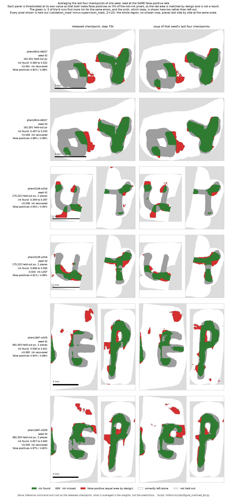

# Free gains on the 9 µm ink checkpoints, and a test bench for measuring them

**Average the weight files of the last four published checkpoints of one seed and you get a single
checkpoint that is better on papyrus the model never saw. No retraining, no GPU, a few seconds of
CPU on files that are already on Hugging Face. Inference costs exactly what it did before, because
what comes out is one checkpoint, not an ensemble.**

Measured on the three segments that ship `_validation_mask.zarr`, the held-out regions the released
checkpoints report their own metrics on:

| segment | AUC before | AUC after | gain |
|---|---|---|---|
| pherc0814-46527 | 0.8558 | 0.8661 | +0.0103 |
| pherc0139-w016 | 0.8550 | 0.8743 | +0.0193 |
| pherc1667-w029 | 0.8957 | 0.9131 | +0.0174 |

Three out of three. It also improves `val_balanced_accuracy`, the metric the checkpoints' own
config declares in `best_checkpoint_metric`, on the same three, by +0.0029 to +0.0379. And the
single run that gains the most is the worst starting point of the six: 0.8014 to 0.8526.

This folder is a self-contained replication package for the
[`scrollprize/ink_9um`](https://huggingface.co/scrollprize/ink_9um) checkpoints released on
2026-08-09. Nothing here trains a model. Every number comes from checkpoints, masks and labels the
Vesuvius Challenge has already published, and every one of them can be regenerated with the scripts
in [`scripts/`](scripts).

It is separate from the rest of this repository, which is about a
[failure atlas of published ink predictions](../README.md). The only thing the two share is the
habit of writing the protocol down before measuring, and publishing the results that did not work
out. Three of the four ideas tested here failed, and they are all
[written up below](#what-replicated-and-what-did-not).

**Contents:** [what a weight soup is](#what-a-weight-soup-is) ·
[step by step](#step-by-step-from-nothing-to-a-scored-number) ·
[using the soup](#using-the-soup-in-your-own-pipeline) ·
[the evidence](#the-evidence)

---

# What a weight soup is

A checkpoint is a file of numbers. `step-075000.pth` holds 508 tensors of weights, which is what
the training run left behind at step 75,000. The published checkpoints of one seed are seven
snapshots of the **same** run, taken at steps 10k, 20k, 30k, 40k, 50k, 60k and 75k.

The recipe is: take four of those files and average them **number by number**.

```
weight #1 of the soup = (weight #1 of 40k + weight #1 of 50k + weight #1 of 60k + weight #1 of 75k) / 4
weight #2 of the soup = (weight #2 of 40k + weight #2 of 50k + weight #2 of 60k + weight #2 of 75k) / 4
...and so on, for every weight in the file
```

That is the whole idea. The result is a file of exactly the same shape, which loads into exactly
the same model. In the literature this is called *weight averaging*, *checkpoint averaging* or
*model soups*, and it is not something invented here. What is contributed here is the measurement
on these checkpoints and these masks, plus the bench that does the measuring.

### Why this is not an ensemble, and why that is the point

There are two different ways to combine several models, and they cost wildly different amounts:

| | what gets averaged | inference cost | what you end up with |
|---|---|---|---|
| **ensemble** | the **predictions**: run N models, average N output images | **N times** | N model files, N GPU runs |
| **weight soup** | the **weights**: average N files into one, before running anything | **once** | 1 model file, 1 GPU run |

An ensemble is a well known way of buying accuracy, and it is a real option here: averaging the
predictions of the two published seeds works well. But it doubles the GPU bill forever, on every
segment you ever run. A soup is paid once, in seconds of CPU, and then costs nothing. That is why
this is worth the trouble: it is the version that helps the default case, which is somebody
downloading one checkpoint and running it once.

### Why four snapshots of one run can be averaged and two runs cannot

Averaging weights is not always safe. It works when the checkpoints sit in the same region of
weight space, which is what "four points along one training trajectory" means. It fails completely
when they do not.

Averaging **seed42 with seed43** produces a model with an AUC of 0.4960 on the region it was
trained on, where the individual checkpoints score 0.999. That is a coin flip. It is not a slightly
worse model, it is not a model at all. Two training runs that start from different random
initialisations end up in two different valleys, and the midpoint between two valleys is a ridge.

There is a thirty second check that catches this before you spend any GPU, and it is
[step 4 below](#4-check-that-the-checkpoints-can-be-averaged-30-seconds-no-gpu). The full
measurement is in [do not average weights across seeds](#do-not-average-weights-across-seeds).

### Why averaging helps at all

The short version: the checkpoint saved at the end of training carries the specific noise of the
last stretch of training, and that noise is different in every run. It is measurable. The two
published seeds become nearly identical on the papyrus they trained on (AUC apart by 0.0002) and
drift **further apart** on the papyrus they did not see (apart by 0.0601, up to 0.107 on one
segment). So a large part of what separates one final checkpoint from another is not knowledge, it
is noise. Averaging four points of the same trajectory cancels that noise and keeps what the four
have in common. The numbers are in [why it works](#why-it-works).

---

# Step by step, from nothing to a scored number

Everything below has been run end to end. Steps 1 to 4 and 6 to 8 need no GPU at all; only step 5,
the inference itself, does.

To get **only** the improved checkpoint, do steps 1, 2, 4 and 5. Steps 3 and 6 to 8 exist to
re-measure the claims rather than take them on faith.

### 0. The code and the dependencies

The inference code is the `merge-ink-pipelines` branch of villa, which is what the official
`ink_9um` README names. Verified against commit `5176522`.

```bash
git clone https://github.com/ScrollPrize/villa
cd villa
git checkout merge-ink-pipelines
```

The scripts in this folder need only what is in [`requirements.txt`](requirements.txt):
numpy, scipy, tifffile, zarr and torch. Torch is used by one script, `weight_soup.py`, purely to
open `.pth` files, and it never touches a GPU. A CPU build is enough.

### 1. Download the four checkpoints

They live in a Hugging Face **bucket**, which `huggingface-cli` does not reach, so
[`scripts/fetch_bucket.py`](scripts/fetch_bucket.py) is included. It handles the two things that
silently break a naive download: the listing is paginated at 1000 entries, and the whole thing
stalls on a network with broken IPv6.

```bash
python scripts/fetch_bucket.py ink_9um/checkpoints/hybrid_3d2d-seed42 ckpt/seed42
python scripts/fetch_bucket.py ink_9um/checkpoints/hybrid_3d2d-seed43 ckpt/seed43
```

Seven files per seed, 138 MB each. If you only want the soup and not the diagnostics, four of them
are enough: `step-040000.pth`, `step-050000.pth`, `step-060000.pth`, `step-075000.pth`. Any single
file can also be fetched directly:

```
https://huggingface.co/buckets/scrollprize/datasets/resolve/ink_9um/checkpoints/hybrid_3d2d-seed42/step-075000.pth
```

### 2. Build the soup (seconds of CPU, no GPU)

```bash
python scripts/weight_soup.py -o soup/A4_seed42.pth \
    ckpt/seed42/step-040000.pth ckpt/seed42/step-050000.pth \
    ckpt/seed42/step-060000.pth ckpt/seed42/step-075000.pth
```

The output is a **named flag** on purpose. With a positional output, getting the argument order
wrong overwrites a 138 MB checkpoint with a soup and says nothing. The script also refuses to
write over an existing file unless `--force` is passed, and refuses outright if the output is also
one of the inputs.

Two things about the result that will look wrong and are not:

- **The soup file is 272 MB, roughly twice the size of its inputs.** The published checkpoints store
  many tensors under two names that share one block of memory (`conv.weight` and
  `all_modules.0.weight` are the same tensor, 244 such pairs). Averaging creates fresh tensors, so
  that sharing is lost and each copy is written out separately. The two names still hold identical
  values, the model loads normally, and this costs disk only.
- **`step` is set to `-1`** in the saved file. The soup does not correspond to any training step and
  should not claim one.

Do the same for seed43 if you want to reproduce the full tables. There is no cross-seed step: that
is the thing that does not work.

### 3. Get the labels and the held-out masks (optional, only to score)

```bash
python scripts/fetch_bucket.py \
    ink_9um/labels/aligned-scrollprizeorg-21slices/pherc0814-46527 \
    labels/pherc0814-46527
```

That is 1,386 files and about 0.1 MiB, because the arrays are mostly empty. Repeat for
`pherc0139-w016` and `pherc1667-w029`. Those three are the only segments of the aligned set that
ship a `_validation_mask.zarr`, which is the entire reason this package uses them.

Each segment folder ends up with three Zarrs, which is the layout the scoring scripts expect:

```
labels/pherc0814-46527/pherc0814-46527_inklabels.zarr
labels/pherc0814-46527/pherc0814-46527_supervision_mask.zarr
labels/pherc0814-46527/pherc0814-46527_validation_mask.zarr
```

### 4. Check that the checkpoints can be averaged (30 seconds, no GPU)

Run this **before** spending GPU time, on any set of checkpoints you have not seen before:

```bash
python scripts/weight_soup.py --diag ckpt/seed42/step-075000.pth ckpt/seed42/step-060000.pth
```

Read the **cosine**, not the distance:

| cosine | meaning |
|---|---|
| above about +0.9 | same region of weight space, the soup will be a working model |
| near 0 | different runs, **the soup will be noise**, do not spend the GPU |

Within one seed the cosine runs from +0.9989 (adjacent steps) down to +0.9148 (step 10k against
step 75k, the furthest pair, and its soup still works). Across seeds it collapses to +0.2769.

Ignore the relative distance for this decision even though the script prints it. The reason it is
printed and why it is the wrong criterion is
[written up below](#the-pre-registered-diagnostic-was-the-wrong-one), because the protocol got it
wrong and the measurement is what corrected it.

### 5. Run inference with the soup (the only GPU step)

The command is the published one. The only thing that changes is which `.pth` is passed:

```bash
python -m koine_machines.inference.infer <input.zarr> soup/A4_seed42.pth out.tif \
    --no-compile --batch-size 1 --num-workers 4
```

`--no-compile` is only needed where `torch.compile` has no Triton backend, which includes Windows.
Drop it elsewhere.

The models expect a **~9.6 µm isotropic** surface volume with 21 slices. Native ~9 µm renders can
be passed straight in, local or by URL. The three segments used here are 2.399 µm volumes, which
have to be pooled first with the official script (XY pyramid level 2, then 4x mean pooling in z):

```bash
python scripts/prepare_9um_isotropic_input.py <surface-volume-2.399um.zarr> pooled.zarr
```

The three source volumes, from the open data bucket:

| segment | surface volume |
|---|---|
| pherc0814-46527 | `PHerc0814/segments/20260226000000-46527_2um_try2/surface-volumes/2.399um-0.22m-78keV-volume-20260309142202.zarr` |
| pherc0139-w016 | `PHerc0139/segments/20250108000004-w029_2025010827/surface-volumes/2.399um-0.22m-78keV-volume-20260102150214.zarr` |
| pherc1667-w029 | `PHerc1667/segments/20251212185248-w029_20251212185248662_flatboi/surface-volumes/2.399um-0.22m-78keV-volume-20251217075048.zarr` |

**A naming trap worth stating out loud:** the label-set name does not track the public segment
number. The segment called `pherc0139-w016` lives in the public folder `...-w029_2025010827`, and
`pherc1667-w029` is a completely different piece of papyrus in a different scroll. Matching them by
the `w` number gives you two wrong volumes and a plausible-looking result. The official `ink_9um`
README says this too, and the table above is the resolved version.

Run parameters used for every number in this package: `patch=128`, `stride=96`,
`blend_mode=gaussian`, the default z window, no TTA, plane Z=10.

### 6. Score it on the held-out region (optional, no GPU)

```bash
python scripts/holdout_9um.py out.tif labels/pherc0814-46527 pherc0814-46527
```

It prints, for the supervised region and for the held-out region separately: AUC, best F1 and the
threshold that achieves it, F1 at the default 0.50, and balanced accuracy at 0.50. Balanced
accuracy is there because it is the metric the checkpoints' own config declares.

Comma separated paths are averaged, which is how the prediction-ensemble rows were produced:

```bash
python scripts/holdout_9um.py out_seed42.tif,out_seed43.tif labels/pherc0814-46527 pherc0814-46527
```

A sanity check while you are here: the AUC on the **supervised** region should land between 0.9985
and 0.9996. That control was declared in advance, and it is what separates "this recipe does not
help" from "this recipe produced a broken model".

### 7. Ask how solid the difference is (optional, no GPU)

```bash
python scripts/bootstrap_auc.py labels/pherc0814-46527 pherc0814-46527 \
    --base  out_base_seed42.tif,out_base_seed43.tif \
    --soup  out_soup_seed42.tif,out_soup_seed43.tif
```

This resamples square **tiles** of the image rather than pixels, because ink comes in strokes and
neighbouring pixels are not independent. See
[how solid the gain is](#how-solid-is-the-gain-block-bootstrap) for what it returned and for the
part of the answer that is unfavourable.

### 8. Regenerate every table in `results/` in one pass (optional, no GPU)

```bash
python scripts/recompute_tables.py soup    --pred-dir preds/ --labels-dir labels/
python scripts/recompute_tables.py steps   --pred-dir preds/ --labels-dir labels/
python scripts/recompute_tables.py zwindow --pred-dir preds/ --labels-dir labels/
```

Every aggregate published in [`results/`](results) comes out of this, at full precision, from the
TIFFs. The filenames it expects are listed in the script's docstring.

**A trap worth naming, because the two conventions differ on purpose:** `holdout_9um.py` and
`bootstrap_auc.py` take the directory of **one** segment, while `recompute_tables.py` covers all
three and therefore takes the **parent** directory.

---

# Using the soup in your own pipeline

There is nothing special to do. The soup is a checkpoint like any other:

- **Same command.** Pass it where you passed `step-075000.pth`. The checkpoints embed their own
  training config, and the soup inherits it untouched, so inference rebuilds the model and its
  normalisation exactly as before.
- **Same cost.** One model, one pass, same batch size, same memory.
- **Same output.** A TIFF of the same shape and the same scale.
- **Same post-processing.** These models train with BCE label smoothing 0.5, so their most confident
  no-ink output sits near 0.25 rather than 0. For display the official advice still applies, rescale
  with `(p - 0.25) / 0.5`, and keep the raw TIFF raw for anything quantitative. The soup does not
  change the calibration: the gain shows up at threshold 0.50 too, which is where balanced accuracy
  is measured.
- **One per seed.** Two seeds were published, so there are two soups. If you can only afford one
  inference, use one soup. If you can afford two, see
  [where the soup does not help](#where-the-soup-does-not-help), because at that cost tier the
  honest answer is to average the predictions of the two plain seeds instead.

What **not** to do:

- Do not soup across seeds, and do not soup all 14 checkpoints together. Both produce coin flips.
- Do not soup checkpoints of a model you have not run `--diag` on first.
- Do not read the `step` field of a soup as a training step. It is set to `-1` for that reason.

---

# The evidence

## What replicated, and what did not

Four ideas were tested with the same pre-registered protocol and the same declared margin
(+0.01 held-out AUC). Each was chosen on `pherc0814-46527` and then confirmed on the other two
segments **without re-selecting anything**.

| idea | gain where it was chosen | the other two segments | verdict |
|---|---|---|---|
| stop at an earlier step (20k) | +0.0325 | +0.0454 and -0.0073 | **did not replicate** |
| shift the z window one plane (`--layer-start 3 --layer-end 20`) | +0.0113 | +0.0030 and -0.0011 | **did not replicate** |
| average weights across the two seeds | random model | not applicable | **broken soup** |
| **average the last 4 checkpoints of one seed** | **+0.0103** | **+0.0193 and +0.0174** | **replicated 3/3** |

A test bench that only produces hits is not a test bench. The three negative results are written
up in full in [`results/`](results), each next to the protocol that was fixed before the run.

---

## Terms, before they are used

| term | what it means here |
|---|---|
| **AUC** | area under the ROC curve. Pick one inked pixel and one non-inked pixel at random; the AUC is the probability the model scores the inked one higher. 0.5 is a coin flip, 1 is perfect. |
| **Balanced accuracy** | the average of sensitivity and specificity at a fixed threshold of 0.50. Unlike AUC it depends on that threshold. It is reported because it is what `best_checkpoint_metric` names. |
| **Weight soup** | averaging the weight files of several checkpoints number by number and keeping **one model**. Not an ensemble: an ensemble runs N models and averages N predictions, at N times the inference cost. A soup costs one. Also called checkpoint averaging. |
| **Held-out region** | the region marked by `_validation_mask.zarr`. Per the `ink_9um` README, the three segments that ship it are *"the online-validation cases the released checkpoints report metrics on"*. |
| **Supervised region** | the region marked by `_supervision_mask.zarr`, which went into training. |

A note on vocabulary that is easy to get wrong, and that this package keeps strict: **"mean" in a
table of AUCs always means the mean of the two seeds' AUCs**, which is what you expect if you pick
one of the two published seeds at random. The AUC of an *averaged prediction* is a different
quantity, it is usually higher, and it is always named explicitly as such.

---

## Why this measurement is clean

| property of the two regions | value |
|---|---|
| same papyrus, same scan, same z window, same annotation | yes |
| measured overlap between `supervision_mask` and `validation_mask` | **0.000%** |
| only difference between them | whether the model saw them during training |

The two masks are disjoint, not nested. Because everything else is matched, the AUC difference
between them measures generalisation rather than comparing different papyri.

The first thing that falls out of this, before any recipe:

| region | AUC of the published checkpoints |
|---|---|
| supervised (seen in training) | 0.999 |
| held out (unseen) | 0.80 to 0.92 |

The models are still good. What changes is how the 0.999 should be read, and what it can be used
for: it is nearly identical across seeds, across training steps and across z windows, so it cannot
be used to choose between them. The held-out number can. That is the whole reason this package
scores on `_validation_mask.zarr`.

---

## The result

AUC on the held-out region, plane Z=10, default z window, no TTA, mean of the two seeds' AUCs:

| segment | single 75k checkpoint | soup of 4 | gain |
|---|---|---|---|
| pherc0814-46527 | 0.8558 | 0.8661 | +0.0103 |
| pherc0139-w016 | 0.8550 | 0.8743 | +0.0193 |
| pherc1667-w029 | 0.8957 | 0.9131 | +0.0174 |

Mandatory control, declared in advance to tell "does not help" apart from "is broken": AUC on
the supervised region stays between 0.9985 and 0.9996 across all six runs. The soup works as a
model.

Per seed, which is where the mechanism shows. Rows sorted by starting point, worst first:

| segment | seed | 75k single | soup of 4 | delta |
|---|---|---|---|---|
| pherc0139-w016 | seed42 | **0.8014** | **0.8526** | **+0.0512** |
| pherc0814-46527 | seed43 | 0.8433 | 0.8630 | +0.0197 |
| pherc0814-46527 | seed42 | 0.8683 | 0.8692 | +0.0009 |
| pherc1667-w029 | seed42 | 0.8717 | 0.8966 | +0.0250 |
| pherc0139-w016 | seed43 | 0.9087 | 0.8960 | **-0.0127** |
| pherc1667-w029 | seed43 | 0.9197 | 0.9297 | +0.0099 |

Five of six improve, and the one that gains by far the most is **the worst starting point of the
six**. If you draw the bad seed, the soup is worth between 0.020 and 0.051 to you.

The mirror image of that sentence is **not** true, and it is worth saying because it is the version
that reads better. The run that gets worse is the *second* best of the six, not the best. The actual
best of the six improves, by +0.0099. The soup does not reliably cost you anything when you start
well; it just does not have much left to give.

---

## It also improves the metric the checkpoints themselves declare

The AUC above is our choice of metric. The checkpoints' own config declares
`best_checkpoint_metric = val_balanced_accuracy`, so the same six runs were scored that way, at
threshold 0.50. That threshold is not a naive default here: the models were trained with
`bce_label_smoothing = 0.5`, which puts the calibrated midpoint exactly there.

| segment | baseline 75k | soup of 4 | delta | (for comparison: AUC delta) |
|---|---|---|---|---|
| pherc0814-46527 | 0.7619 | 0.7649 | **+0.0029** | +0.0103 |
| pherc0139-w016 | 0.7507 | 0.7750 | **+0.0243** | +0.0193 |
| pherc1667-w029 | 0.7902 | 0.8281 | **+0.0379** | +0.0174 |

**Three out of three on the segment means, on the authors' own declared metric**, with the same
shape as the AUC: the two runs that gain most are the two worst starting points. Mean gain +0.0217
here against +0.0157 in AUC.

Two caveats that belong next to that comparison, because putting the last two columns side by side
invites a mistake:

1. **It is larger on two segments and smaller on the third**, and that third one is
   `pherc0814-46527`, the segment the recipe was selected on. Quoting only the +0.0379 would be
   picking the convenient number.
2. **Balanced accuracy is noisier than AUC** because it is measured entirely at threshold 0.50,
   while AUC depends on no threshold, so part of a gain there can come from the prediction being
   better calibrated rather than better ordered. It shows in the detail: 4 of the 6 individual runs
   improve, against 5 of 6 in AUC.

The per-seed breakdown is in [`results/soup_results.md`](results/soup_results.md).

---

## Why it works

The step sweep turned up something that was not being looked for. Separation between the two
seeds, as absolute AUC difference, as training progresses:

| region | at 20k steps | at 75k steps | direction |
|---|---|---|---|
| supervised | 0.0107 | 0.0002 | **converge**, fifty times closer |
| held out | 0.0146 | 0.0601 | **diverge**, four times further apart |

At the end of training the two checkpoints are twins on the region they were trained on and a
lottery on the region they were not. If that late divergence is noise from the tail of the
trajectory, averaging the trajectory should remove it. Measured:

| seed separation, held-out region | 75k single | soup of 4 |
|---|---|---|
| pherc0814-46527 | 0.0250 | 0.0062 |
| pherc0139-w016 | 0.1073 | 0.0435 |
| pherc1667-w029 | 0.0481 | 0.0331 |
| **mean** | **0.0601** | **0.0276** |

The seed lottery is cut to less than half, on all three segments. The soup is not a trick that
happened to work: it is the remedy the earlier finding predicted.

---

## How solid is the gain: block bootstrap

The held-out region has a few hundred thousand pixels, which looks like an enormous sample. It is
not: ink comes in strokes, so neighbouring pixels are not independent and neither are the model's
errors. [`scripts/bootstrap_auc.py`](scripts/bootstrap_auc.py) resamples square tiles of the image
with replacement instead of pixels, and recomputes the same statistic that is reported, 1000 times.

P(delta > 0) ranges from 0.929 to 0.991 across all twelve segment-by-blocksize cells, and all three
point estimates are positive. But **no single segment reaches 95% confidence on its own**: the
interval includes zero in 6 of the 12 cells, and on `pherc0814-46527`, the segment where the soup
was selected, it includes zero at three of the four block sizes. The +0.0103 that cleared the
pre-registered margin there should not be read as a significant result on that segment.

So the load-bearing evidence is **not** the margin on the selection segment. It is that the effect
replicates on two further segments where nothing was chosen, in the same direction, at a similar
size, in a metric of our choice and in the authors' own metric. Full intervals and block counts in
[`results/soup_results.md`](results/soup_results.md).

---

## Does the soup buy clearness by losing faint ink?

A Vesuvius team member raised the obvious objection to the before/after figure: ensembles can gain
"clearness, like smoothing out the letters", while losing fainter signal. The AUC above is computed
over every held-out pixel, so it is dominated by the bulk of the ink and cannot answer that.

[`protocols/faint_signal_protocol.md`](protocols/faint_signal_protocol.md) was fixed before any of
the numbers existed. Ink is split into difficulty quartiles by **the other seed's** baseline, and
recall is compared at a threshold set so both models produce **the same false positive rate on
non-ink**, because recall at a shared numeric threshold is not a comparison.

**The primary statistic came out NOT RESOLVED** and is published in those words: hardest-quartile
recall delta +0.0049 / -0.0437 / +0.0726 on the three segments, and the +0.0049 is degenerate
because recall there is 0.0000 for both models. Three things did come out clean:

| question | answer |
|---|---|
| is the soup smoother? | yes, gradient energy 6% to 16% lower in **5 of 6** runs (the sixth is flat) |
| does the AUC gain survive a fixed operating point? | yes, overall recall at matched FPR 5% gains +0.036 to +0.085 in **5 of 6** runs |
| is it just firing more everywhere? | no, the non-ink negative control is inside +-0.014 in 23 of 24 cells |



The middle row of that table is the one worth looking at, so it is drawn rather than asserted. Each
panel is thresholded at its own value so that both make false positives on 5% of the non-ink pixels:
**the red area is matched by design and is not a result, the green is.** All six runs are shown,
including the one that loses.

Two things the figure gives away about our own result, on purpose. The grey that remains is mostly
the outer rim of each stroke, so what is visible is the soup filling more of the annotated stroke,
which is what recall means but is not the same as finding faint letters nobody had. And on
`pherc0814-46527` the left blob stays grey in all four panels: that is the hardest quartile of ink,
and neither model recovers any of it at this operating point.

The one run that loses is `pherc0139-w016` seed43, already published above as the single regression.
The exogenous geometric stratifier shows it losing by the same amount at every stroke thickness,
which is a run that is worse overall rather than selective damage to weak ink.

**It says nothing about cross-scroll generalisation**, the other half of the objection. All 24
aligned segments were training data, so no unseen scroll with annotation exists in public data.
Full tables, the failed half of the declared prediction, and the four bootstrap lines that fell
below the block floor: [`results/faint_signal_results.md`](results/faint_signal_results.md).

---

## Do not average weights across seeds

| soup | supervised AUC | held-out AUC |
|---|---|---|
| seed42 + seed43 at 75k | **0.4960** | 0.4863 |
| all 14 checkpoints | **0.5037** | 0.5108 |

0.50 is a coin flip. These models fail even on the papyrus they **did** train on, where single
checkpoints give 0.999.

This is detectable in about thirty seconds without touching a GPU, by measuring the cosine
between the two weight vectors:

| pair of checkpoints | relative distance | cosine |
|---|---|---|
| seed42 75k vs seed42 60k | 0.0532 | +0.9989 |
| seed42 75k vs seed42 40k | 0.2836 | +0.9801 |
| seed42 75k vs seed42 10k | 1.3417 | +0.9148 |
| **seed42 75k vs seed43 75k** | **1.1936** | **+0.2769** |

### The pre-registered diagnostic was the wrong one

**And the run is what showed which one works.** `soup_protocol.md` predicted the breakage from the
**relative distance** between weights. Distance does not separate the cases: step 10k of the *same*
seed sits at 1.3417, further than the cross-seed pair at 1.1936, and yet the soup containing step
10k is not broken. Cosine does separate them cleanly, +0.9148 within a seed against +0.2769 across
seeds. Once measured the reason is not mysterious: distance is dominated by the norm, and step 10k
has 2.19 times the norm of step 75k, so a large distance can mean "different direction" or merely
"different scale", and only the first breaks a soup.

For anyone reproducing this the usable rule is the cosine, and `weight_soup.py --diag` prints both.

### How that cosine is computed, and the float64 trap

It is **one** cosine per pair of checkpoints, not millions of cosines. Each checkpoint is flattened
conceptually into a single long vector, and the standard formula is applied to those two vectors:

```
dot    = 0
norm_A = 0
norm_B = 0
for i in range(len(A)):            # every weight in the checkpoint
    dot    += A[i] * B[i]
    norm_A += A[i] * A[i]
    norm_B += B[i] * B[i]

cosine = dot / (sqrt(norm_A) * sqrt(norm_B))
```

The vector has 68,175,426 entries, which is the sum over the 508 tensors in the state dict.
**That double counts**: only 264 of those tensors hold distinct memory, so the model really has
34,546,498 parameters and 244 of them appear under two names each. Recomputed over distinct
tensors only, the cosines move in the fourth decimal and not at all in the conclusion: +0.9989,
+0.9141 and +0.2697 against the +0.9989, +0.9148 and +0.2769 above. It is stated here rather than
quietly fixed because "68 million parameters" is the kind of number a reader will repeat.

The precision trap is real regardless of which count is used. A float32 number carries about 7
significant decimal digits. Once `dot` has grown to, say, 1000, adding a term of 0.00001 to it
changes nothing: the result rounds back to the same float32 and the term is silently discarded.
Over tens of millions of additions a great many terms are discarded that way, and `dot`, `norm_A`
and `norm_B` each lose a different amount, so the ratio between them drifts.

The first version of this diagnostic accumulated in float32 and returned **cosines of 1.02**,
which is impossible: a cosine cannot exceed 1. That impossible value is what exposed the bug. A
smaller error would have gone unnoticed and been reasoned about as if it were real.

The fix is to accumulate in **float64** and cast at the end, which is what
[`scripts/weight_soup.py`](scripts/weight_soup.py) does. The soup itself also accumulates in
float64 and saves in float32. For the soup this is reproducibility, not correctness: only 4
numbers are summed per weight, and the largest difference against float32 accumulation is
**1.192e-07**. It does not move the AUC (four decimals identical on three of four runs, 0.0001 on
the fourth). It does mean the resulting weights do not depend on the order the files are passed in.

---

## The two suggestions in the official README, both tested

The `ink_9um` README says, verbatim:

> "If a checkpoint is not responding well on your data, it might just be a z layer offset; the
> models can be quite sensitive to it, and picking a different z window (`--layer-start`/
> `--layer-end`) can help. Averaging predictions over a few nearby z windows also works as a simple
> ensemble."

That is two separate pieces of advice, and they do not fare the same way.

| the suggestion | what was measured | verdict |
|---|---|---|
| shifting the z window can help | the best position gains +0.0113 on the segment where it was chosen, but +0.0030 and -0.0011 on the other two | **correct as written, and only as written.** It helps *per segment*. No globally better window was found |
| averaging a few nearby windows works as a simple ensemble | +0.0010 for three windows, +0.0003 for five | **buys nothing measurable here**, at three to five times the inference cost |

The second one is the useful negative result for anyone who downloads a checkpoint: if you are
going to spend more than one inference, spend it on the second seed rather than on nearby z
windows. Full sweep in [`results/zwindow_results.md`](results/zwindow_results.md).

---

## Where the soup does not help

At the cost of **two** inferences, compared against averaging the predictions of the two seeds:

| segment | average of the 2 seeds' predictions | average of the 2 soups | delta |
|---|---|---|---|
| pherc0814-46527 | 0.8676 | 0.8751 | +0.0075 |
| pherc0139-w016 | 0.9044 | 0.8966 | **-0.0079** |
| pherc1667-w029 | 0.9237 | 0.9312 | +0.0075 |

Two of three, one against, none reaching the margin. **At that cost tier the soup does not
replicate and is not recommended.** If you can afford two inferences, average the two seeds.

These are AUCs of an averaged *prediction*, a different quantity from the means of two AUCs in the
tables above. They are not comparable across tables.

The soup wins exactly where averaging predictions is not an option: when a single model is run,
which is the default for anyone who downloads a checkpoint.

---

## Files in this folder

| path | what it is |
|---|---|
| [`protocols/step_sweep_protocol.md`](protocols/step_sweep_protocol.md) | training-step sweep, fixed before the run |
| [`protocols/zwindow_protocol.md`](protocols/zwindow_protocol.md) | z window sweep, fixed before the run |
| [`protocols/soup_protocol.md`](protocols/soup_protocol.md) | weight soup, fixed before the run, including the prediction that cross-seed soups would break |
| [`protocols/faint_signal_protocol.md`](protocols/faint_signal_protocol.md) | does the soup buy clearness by losing faint ink, fixed before the run |
| [`results/holdout9_results.md`](results/holdout9_results.md) | supervised vs held-out, the baseline everything else is measured against |
| [`results/step_sweep_results.md`](results/step_sweep_results.md) | step sweep: **did not replicate** |
| [`results/zwindow_results.md`](results/zwindow_results.md) | z window sweep: **did not replicate** |
| [`results/soup_results.md`](results/soup_results.md) | weight soup: **replicated 3/3** |
| [`results/faint_signal_results.md`](results/faint_signal_results.md) | faint-ink audit of the soup: primary **not resolved**, but the gain survives at a matched false positive rate in 5 of 6 runs |
| [`results/faint_signal_run.txt`](results/faint_signal_run.txt) | verbatim stdout of that run, including the cells the write-up does not quote |
| [`scripts/faint_signal.py`](scripts/faint_signal.py) | matched-FPR recall by ink difficulty, gradient energy, negative control, block bootstrap |
| [`scripts/figure_matched_fpr.py`](scripts/figure_matched_fpr.py) | draws all six runs thresholded at a matched false positive rate, and recomputes the numbers it prints |
| [`figures/soup_matched_fpr.png`](figures/soup_matched_fpr.png) | that figure |
| [`scripts/fetch_bucket.py`](scripts/fetch_bucket.py) | downloads checkpoints and labels from the HF bucket, paginated and in parallel |
| [`scripts/weight_soup.py`](scripts/weight_soup.py) | builds soups, and the `--diag` distance and cosine check |
| [`scripts/holdout_9um.py`](scripts/holdout_9um.py) | scores a prediction on both regions |
| [`scripts/bootstrap_auc.py`](scripts/bootstrap_auc.py) | block bootstrap of the difference between two predictions |
| [`scripts/recompute_tables.py`](scripts/recompute_tables.py) | regenerates every aggregate in `results/` from the TIFFs, at full precision |
| [`requirements.txt`](requirements.txt) | dependencies; only the soup builder needs torch, nothing needs a GPU |

The `protocols/` files are the pre-registration. They are **never edited after the run**, because a
protocol that gets tidied up afterwards is not a protocol. Every correction lives in `results/` and
in this README instead. Two consequences a reader will notice, and neither is a typo:

- `soup_protocol.md` predicts the cross-seed breakage from the relative distance. The run falsified
  that and the cosine is what works. The protocol keeps the wrong prediction.
- `soup_protocol.md` quotes the 20k seed separation as 0.0145 where `results/` says 0.0146. The
  protocol was written before the aggregates were recomputed at full precision; 0.0146 is the
  correct value and `scripts/recompute_tables.py steps` regenerates it.

---

## Limitations

| limitation | detail |
|---|---|
| n = 3 segments | the ceiling with public data: they are the only ones with `_validation_mask.zarr`, and the `ink_9um` README confirms all 24 aligned segments were training data |
| 2 seeds | the two that were published |
| no segment is individually significant | block bootstrap; the evidence is the replication, not the margin |
| 1 of the 6 individual runs gets worse | seed43 on pherc0139-w016, -0.0127 |
| the mechanism is a tendency, not a law | Pearson r = -0.82 on n = 6, driven by one point; the rank correlation is not significant |
| plane Z=10 only | the only annotated plane of the aligned set |
| no TTA | deliberately, so effects do not mix |
| cannot say which seed is better in general | n = 3 does not support it |
| the faint-ink question is open | the pre-registered primary came out mixed and is declared **not resolved**; what is measured is that the soup is smoother and that its gain survives a matched false positive rate |
| nothing here is cross-scroll | every measurement is within-scroll, within-segment, held-out region, because no unseen annotated scroll exists in public data |

The soup `.pth` files are not published here: they are 272 MB each and rebuilding one from the
released checkpoints takes seconds of CPU, so the recipe is cheaper to verify than the artefact.

## License

Code MIT, documentation CC BY 4.0, same as the rest of this repository.
